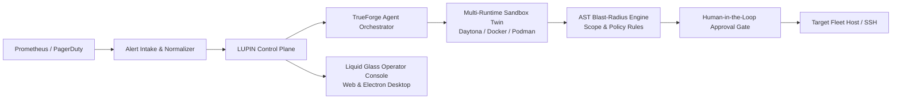

# LUPIN-007: Incident Command Deck

> **Autonomous Incident Forensics, Multi-Runtime Sandbox Twins & Blast-Radius Governance for Production Infrastructure**

[](LICENSE)
[](https://nodejs.org)
[](https://www.typescriptlang.org)
[](https://react.dev)
[](https://www.electronjs.org)

---

## Overview

**LUPIN-007 (Incident Command Deck)** is an autonomous AI incident response and infrastructure reliability system. When production alerts fire from **Prometheus AlertManager** or **PagerDuty**, LUPIN captures the affected host's live state (processes, open sockets, systemd services, filesystem diffs), replicates the issue inside an isolated **Sandbox Twin**, autonomously conducts diagnostic experiments, and verifies proposed remediation commands through an **AST Blast-Radius Policy Engine** before requesting Human-in-the-Loop approval.



---

## Core Architecture & Subsystems

### 1. Incident Plane & Alert Normalization
- **Multi-Source Ingestion (`/alerts`)**: Normalizes payloads from Prometheus AlertManager, PagerDuty v2/v3 webhooks, and raw JSON alerts.
- **Autonomous Reasoning Stream**: Connects to the **TrueForge Agent Engine** using configurable models (`google-gemini/gemini-2.5-flash`, `gemini-2.5-pro`, `anthropic/claude-3-5-sonnet`, `openai/gpt-4o`, or local LLMs).
- **Incident State Machine**: Manages lifecycles across `triaged` → `diagnosing` → `awaiting_approval` → `approved` → `resolved` / `failed` / `cancelled`.
- **Durable SQLite Persistence (`data/incident-deck.db`)**: Write-Ahead Logging (WAL) mode storing `incidents`, `sessions`, `messages`, `fleet_hosts`, `settings`, and `policy_rules` with foreign-key cascade enforcement.

### 2. Multi-Runtime Sandbox Subsystem
Auto-discovers, tests, and provisions ephemeral sandbox twins for safe command execution and chaos reproduction:
- **Daytona Cloud & Dedicated**: Remote containerized sandbox workspaces via TrueForge Sandbox API.
- **Docker Daemon**: Local container runtime via `/var/run/docker.sock`.
- **Podman**: Rootless/rootful container daemon via `/run/podman/podman.sock` or `XDG_RUNTIME_DIR`.
- **Isolated Process Runner**: Host-level sandboxed execution with scrubbed environment variables and process scoping.

### 3. AST Blast-Radius & Policy Engine
- **Quote-Aware Shell AST Parser**: Tokenizes and decomposes complex shell commands (subshells, pipes, `;`, `&&`, `||`).
- **Privilege Wrapper Unwrapping**: Normalizes execution across `sudo`, `doas`, `sh -c`, `bash -c`, `zsh -c`, and environment assignments.
- **Side-Effect Extraction**: Extracts impacted file paths, network ports, listening sockets, and systemd units.
- **Dynamic Policy Simulation**: Evaluates proposed commands against configurable regex safety rules, scoring risk (`low`, `medium`, `high`, `critical`) and generating instant safety badges (`destructive`, `network`, `privilege`).

### 4. Automated Demo Cluster & Prometheus Pipeline
- **Orchestrated Docker Compose Stack**: Spins up a 4-node simulated microservices topology:
  - `tf-server`: Gateway server with SSH access (`:2222`)
  - `client1`: Redis / Cache node with node-exporter sidecar
  - `client2`: Nginx & MySQL database node with node-exporter sidecar
  - `client3`: API backend worker node with node-exporter sidecar
  - `prometheus` & `alertmanager`: Real-time scraping and webhook delivery (`:9090`, `:9093`)
- **8 Pre-configured Incident Scenarios**: `HighCPUUsage`, `DiskSpaceCritical`, `NginxDown`, `MySQLDown`, `RedisDown`, `HighMemoryUsage`, `LoadAverageHigh`, `SSLCertExpiring`.

### 5. Operator Console (Liquid Glass UI & Electron Desktop)
- **Luminous Obsidian Glass UI**: High-density operational interface built with React 19, Tailwind CSS, Lucide icons, and Framer Motion.
- **Live Terminal (`LiveTerminal.tsx`)**: Real-time xterm.js terminal streaming agent command execution and SSH probe sessions.
- **Interactive Incident Deck**: Side-by-side diagnostic logs, proposed script diffs, safety badges, and 1-click Approval/Reject gates.
- **Topology Map & Blast Radius Cards**: Live visual maps of fleet nodes and dependency trees.
- **Desktop Packaging**: Standalone Electron app with built-in subprocess lifecycle manager for control plane and TrueForge daemons.

---

## Repository Structure

```
├── alert_rules.yml            # Prometheus alert rules for 8 demo incident presets
├── docker-compose.yml         # 4-node simulated demo cluster + Prometheus stack
├── prometheus.yml             # Prometheus scrape configuration & alertmanager target
├── install.sh                 # All-in-one terminal installer for Linux/macOS
├── package.json               # Backend & CLI build and test scripts
│
├── src/                       # Backend Control Plane (Node.js + TypeScript + Express)
│   ├── index.ts               # CLI & production server entrypoint
│   ├── server.ts              # Express HTTP application & WebSocket /ws server
│   ├── db.ts                  # SQLite WAL database initialization & repository schema
│   ├── incidents.ts           # In-memory & SQLite incident state machine
│   ├── incident-plane.ts      # Alert routing, TrueForge reasoning & approval gate
│   ├── command-scope.ts       # AST parser, wrapper unwrapping & risk classifier
│   ├── policy.ts              # Regex policy engine & simulation evaluator
│   ├── capture.ts             # Host telemetry & socket probe capture
│   │
│   ├── demo/                  # Automated Demo Cluster Orchestrator
│   │   ├── compose-orchestrator.ts
│   │   └── compose-orchestrator.test.ts
│   │
│   ├── routes/                # REST API Route Controllers
│   │   ├── demo.ts            # /api/demo/start, /api/demo/stop, /api/demo/trigger
│   │   ├── fleet.ts           # /api/fleet/hosts, /api/fleet/probe
│   │   ├── models.ts          # /api/models
│   │   ├── policy.ts          # /api/policy/rules, /api/policy/simulate
│   │   ├── sandbox.ts         # /api/sandboxes/probes, /api/settings/sandbox
│   │   ├── sessions.ts        # /api/sessions, /api/sessions/:id/messages
│   │   └── settings.ts        # /api/settings
│   │
│   └── sandboxes/             # Multi-Runtime Sandbox Subsystem
│       ├── manager.ts         # Sandbox runtime auto-discovery & router
│       ├── types.ts           # Sandbox interfaces and types
│       ├── container-runners.ts # Docker & Podman runners
│       ├── daytona-runner.ts  # Daytona cloud/dedicated client
│       └── socket-probe.ts    # Socket probing & daemon usability checks
│
├── dashboard/                 # Frontend Operator Console (Vite + React 19 + TypeScript)
│   ├── package.json           # Dashboard frontend dependencies and scripts
│   ├── electron/              # Electron Desktop Application
│   │   ├── main.cjs           # Desktop window supervisor & daemon orchestrator
│   │   ├── preload.cjs        # Secure IPC bridge
│   │   └── electron-config.test.ts
│   └── client/                # React Single Page App
│       ├── src/components/    # IncidentDeck, LiveTerminal, FirstRunSetup, TopBar
│       ├── src/hooks/         # useControlPlane, useFleetManager, usePolicyEngine
│       ├── src/pages/Home.tsx # Main Command Deck viewport
│       └── src/types/         # Domain TypeScript models
│
└── docs/                      # Technical Architecture Specifications
    └── superpowers/specs/     # SDD specs, packaging guides & incident loop designs
```

---

## Quick Start

### Prerequisites
- **Node.js**: `v20.0.0` or higher
- **pnpm**: `v9.x` or higher
- **Container Engine** *(optional, for local demo cluster)*: Docker or Podman

### Option A: One-Line Installer (Linux / macOS)

```bash
git clone https://github.com/Ramanpreet21/LUPIN-007.git
cd LUPIN-007
chmod +x install.sh
./install.sh
```

### Option B: Manual Setup

1. **Install Root & Dashboard Dependencies**:
   ```bash
   npm install
   cd dashboard && pnpm install && cd ..
   ```

2. **Build Backend & Frontend**:
   ```bash
   npm run build
   cd dashboard && pnpm run build && cd ..
   ```

3. **Start the Control Plane**:
   ```bash
   PORT=3001 npm run start
   ```

4. **Launch Developer Mode (Concurrent Backend + Frontend Hot Reload)**:
   ```bash
   # Terminal 1: Backend Control Plane
   npm run dev

   # Terminal 2: Dashboard Frontend
   cd dashboard && pnpm run dev
   ```

5. **Launch Electron Desktop App**:
   ```bash
   cd dashboard && pnpm run electron:dev
   ```

---

## API Reference

| Endpoint | Method | Description |
|---|---|---|
| `/health` | `GET` | System health, TrueForge readiness, active incident counts |
| `/alerts` | `POST` | Ingest webhook from AlertManager, PagerDuty, or custom alert |
| `/incidents` | `GET` | List incidents filtered by status with chronological ordering |
| `/incidents/:id` | `GET` | Get detailed incident metadata, telemetry, and execution logs |
| `/api/approvals` | `POST` | Approve (`action: "approve"`) or deny (`action: "deny"`) pending command |
| `/api/emergency-stop`| `POST` | Instantly abort all in-flight diagnosing and approved sessions |
| `/api/models` | `GET` | Retrieve available LLM models and active model selection |
| `/api/fleet/hosts` | `GET` / `POST` | List and register fleet target machines |
| `/api/fleet/probe` | `POST` | Execute live TCP/SSH connectivity probe on target host |
| `/api/sandboxes/probes` | `GET` | Auto-discover and probe all installed sandbox runtimes |
| `/api/policy/rules` | `GET` / `POST` | List and create regex-based AST execution policy rules |
| `/api/policy/simulate` | `POST` | Simulate a proposed command string against policy rules |
| `/api/settings` | `GET` / `PUT` | Read and configure operator preferences and model keys |
| `/api/demo/start` | `POST` | Provision local Docker Compose demo cluster |
| `/api/demo/trigger` | `POST` | Trigger one of 8 Prometheus alert presets into the pipeline |
| `/api/demo/stop` | `POST` | Tear down demo cluster and reset database state |
| `/ws` | `WebSocket` | Real-time event stream (`incident_created`, `pending_approval`, `stream_token`) |

---

## Testing & Quality Assurance

Run the comprehensive test suite across backend services, sandboxes, policy parser, and desktop packaging:

```bash
# Run all backend unit and integration tests (158 tests)
npm test

# Run frontend typecheck
cd dashboard && pnpm run check

# Run Electron desktop configuration tests
cd dashboard && npx vitest run --dir electron

# Build full production artifacts
npm run build && cd dashboard && pnpm run build
```

---

## License

This project is licensed under the [MIT License](LICENSE).
