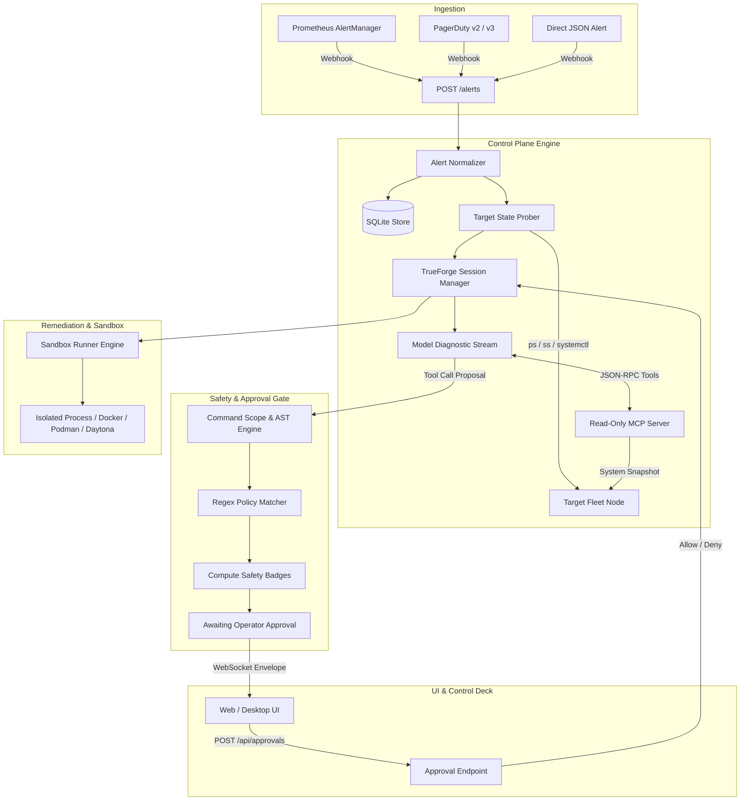
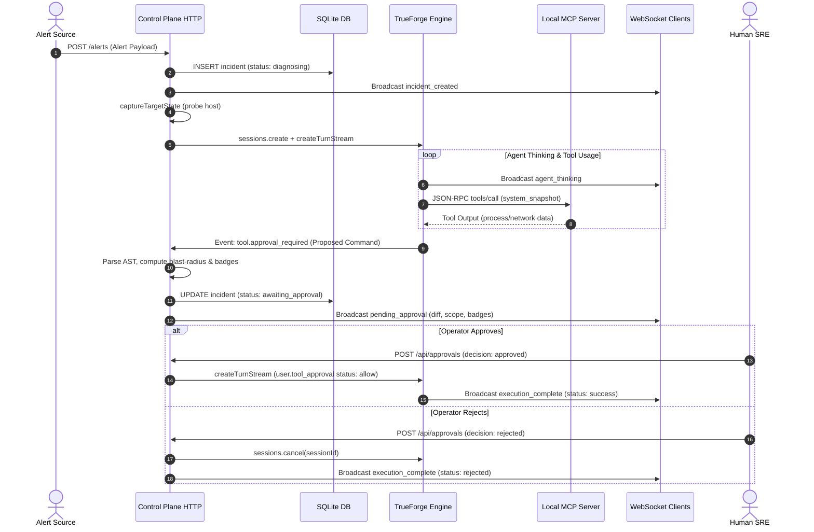

# Incident Command Deck Architecture

## Overview

007 (Incident Command Deck) is a local SRE control plane and autonomous incident response orchestrator. It receives telemetry and anomaly alerts from monitoring systems, runs AI-driven diagnostic investigations on target hosts, isolates proposed remediations within sandboxes, and enforces deterministic AST safety policies before human operators sign off on execution.

The system is built on top of the TrueForge agent framework and integrates directly with Prometheus AlertManager, PagerDuty, and Linux fleet nodes.

## Architecture Diagram

## Components

### 1. Alert Ingestion & Normalizer

**Purpose**: Ingests, validates, and normalizes alerts from heterogeneous monitoring systems into a standard internal shape.

**Location**: `src/incidents.ts`

**Key Functions**:
- `normalizeWebhooks(raw)`: Auto-detects webhook format (AlertManager, PagerDuty, Canonical) and parses alert records.
- `normalizeAlert(raw)`: Validates mandatory fields (`service_name`, `target_host`, `severity`) and strips dangerous control characters.
- `createIncident(alert)`: Initializes incident record and tracks status lifecycle.

**Interactions**:
- Receives HTTP input from `POST /alerts` in `src/incident-plane.ts`.
- Stores records in SQLite database `incidents` table.
- Triggers `runDiagnosis()` in `src/incident-plane.ts`.

---

### 2. Live Target State Capture

**Purpose**: Snapshots the target node state before starting the agent session, ensuring diagnostic prompts contain verifiable telemetry.

**Location**: `src/capture.ts`

**Key Functions**:
- `captureTargetState(targetHost, serviceName, opts)`: Executes read-only commands (`ps aux --forest`, `ss -tulnp`, `systemctl status`) against the host.
- `formatCapturedState(state)`: Formats captured state into a markdown block marked as untrusted alert context.

**Interactions**:
- Invoked by `runDiagnosis()` prior to opening a TrueForge session.
- Passes formatted telemetry directly to the agent's turn input.

---

### 3. Read-Only MCP Tool Server

**Purpose**: Exposes local Model Context Protocol (MCP) tools over JSON-RPC at `POST /mcp` to let the agent query host telemetry without write privileges.

**Location**: `src/mcp-provider.ts`

**Key Functions**:
- `createMcpRouter()`: Mounts JSON-RPC endpoint implementing `initialize`, `tools/list`, `tools/call`, and `ping`.
- Tools provided: `system_snapshot`, `process_tree`, `net_connections`, `service_status`, `journal_logs`, `file_read`, `dns_lookup`.

**Interactions**:
- Registered with TrueForge via agent spec `mcpServers` configuration.
- TrueForge invokes tool handlers during autonomous investigation turns.

---

### 4. AST Safety & Command Scoping Engine

**Purpose**: Evaluates proposed remediation commands, decomposes shell statements, matches active policy rules, and estimates blast radius.

**Location**: `src/command-scope.ts`, `src/policy.ts`, `src/shell-parse.ts`

**Key Functions**:
- `splitCompoundStatements(command)`: Splits shell compound statements (`&&`, `;`, `|`) while respecting quotes and subshells.
- `extractCommandSubstitutions(command)`: Recursively extracts nested command substitutions (`$(...)`, `` `...` ``).
- `annotateCommandScope(command)`: Identifies affected files, ports, sockets, services, and risk score.
- `simulatePolicy(command)`: Runs the command against active rules in the `policy_rules` table and computes risk (0–100).
- `computeSafetyBadges(command)`: Evaluates boolean pass/fail status against core invariants (`destructive`, `privilege-escalation`, `eval`).

**Interactions**:
- Intercepts `tool.approval_required` events emitted by TrueForge during agent execution.
- Generates structured payload for `pending_approval` WebSocket event.

---

### 5. Multi-Runtime Sandbox Manager

**Purpose**: Manages ephemeral execution environments to test hypotheses or run remediation actions without impacting production directly.

**Location**: `src/sandboxes/manager.ts`, `src/sandboxes/container-runners.ts`, `src/sandboxes/daytona-runner.ts`, `src/sandboxes/isolated-process-runner.ts`

**Key Functions**:
- `SandboxManager.probeAll()`: Probes status of all registered sandbox runners (subprocess, Docker, Podman, Daytona).
- `SandboxManager.execInActive(command)`: Creates an ephemeral sandbox session, executes the command, and destroys the environment.

**Interactions**:
- Controlled via `/api/sandboxes/*` and `/api/settings/sandbox` routes.

---

## Data Flow & Lifecycle

## Configuration

Configuration values are loaded from environment variables on startup by `src/config.ts`.

| Key | Variable | Default | Purpose |
|---|---|---|---|
| Port | `PORT` | `3000` | HTTP & WebSocket listen port |
| Host | `HOST` | `127.0.0.1` | Network interface binding |
| TrueForge Base URL | `TRUEFORGE_BASE_URL` | `http://localhost:8765` | TrueForge API address |
| TrueForge Model | `TRUEFORGE_MODEL` | `anthropic/claude-sonnet-5` | Default diagnostic model |
| Control Plane URL | `CONTROL_PLANE_URL` | `""` | Externally reachable address for remote MCP callback |

## Code References

| Component | File | Key Symbols |
|---|---|---|
| Entry Point | `src/index.ts` | `main()`, `parseArgs()` |
| Server Core | `src/server.ts` | `startServer()`, `ServerHandle` |
| Incident Plane | `src/incident-plane.ts` | `createIncidentRouter()`, `runDiagnosis()`, `resumeApproval()` |
| Incident Store | `src/incidents.ts` | `createIncident()`, `normalizeAlert()`, `normalizeWebhooks()` |
| State Capture | `src/capture.ts` | `captureTargetState()`, `formatCapturedState()` |
| Command Scope | `src/command-scope.ts` | `annotateCommandScope()`, `splitCompoundStatements()` |
| Policy Store | `src/policy.ts` | `listPolicyRules()`, `simulatePolicy()`, `validateSafeRegex()` |
| Shell Parser | `src/shell-parse.ts` | `splitShellStatements()`, `shellWords()`, `effectiveCommand()` |
| MCP Server | `src/mcp-provider.ts` | `createMcpRouter()`, `callTool()`, `LOCAL_MCP_NAME` |
| Database Engine | `src/db.ts` | `initDb()`, `getDb()`, `seedDefaults()` |
| Sandbox Manager | `src/sandboxes/manager.ts` | `SandboxManager`, `getSandboxManager()` |

## Glossary

| Term | Definition |
|---|---|
| **TrueForge** | The underlying agent runtime and orchestration framework. |
| **AST (Abstract Syntax Tree)** | Structural representation of shell commands used to detect subshells and forbidden operations. |
| **Blast Radius** | The set of files, network sockets, systemd services, and ports modified by a command. |
| **Safety Badge** | Visual pass/fail status computed against deterministic security policies. |
| **MCP (Model Context Protocol)** | Open protocol allowing LLMs to interact with external tools and read-only diagnostic sources. |
